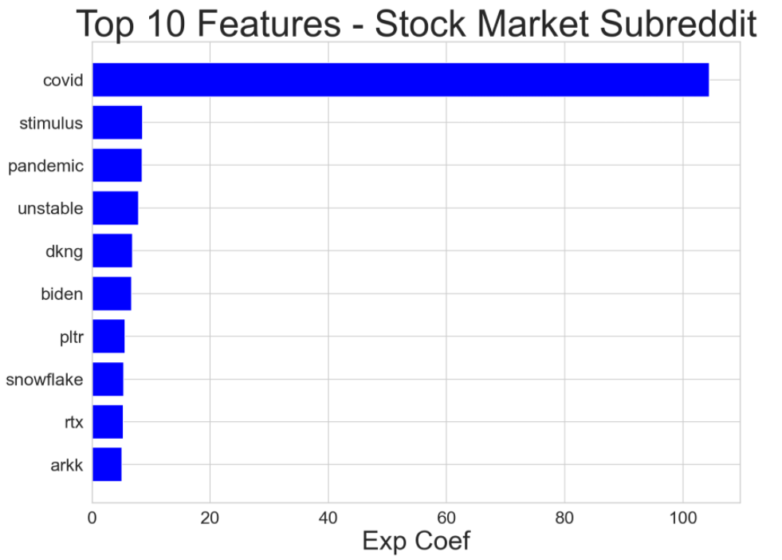
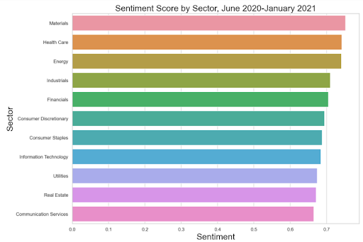
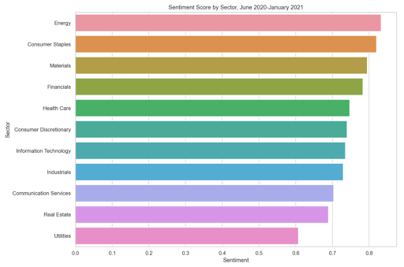
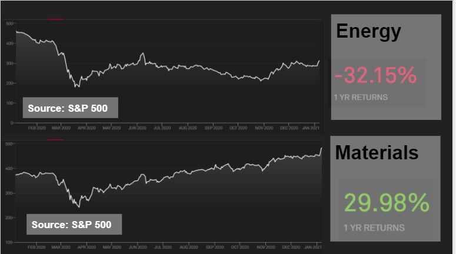

### Contents:
- [Problem Statement](#Problem-Statement)
- [Executive Summary](#Executive-Summary)
- [The Process](#The-Process)
- [Data Dictionary](#Data-Dictionary)
- [Model Selection](#Model-Selection)
- [Conclusion and Recommendations](#Conclusion-and-Recommendations)

# Problem Statement

Can sentiment analysis on financial text be optimized by identifying key words in the news? 

# Executive Summary

In many ways, the value of the stock market is the cumulative efforts of billions of individuals around the world. The stock market represents the aggregation of the value of companies. Shares outstanding multiplied by the value of a share numerically represent the market capital of the company. Changes in stock prices are a combination of investor sentiment and the value produced and held by the company. In general, if a company, which is a collection of people and value production, provides a good return on capital deployed or has the speculative potential to provide good returns in the future the educated investor's sentiment will be positive. This project makes the assumption that stock pricing is not random, although there are movements that are not able to be described adequately. Tuning into this frequency a person finds a complex and highly stochastic system representative of people, how they spend their time, and the value they create. It is worth describing and understanding its movements, as through this understanding a person can gain a greater appreciation of the complex and highly stochastic world that they live in. 

A major portion of stock valuation is a combination of fundamental and technical analysis. If a person has a good understanding of these two components they are reasonably able to price out many components of stock price and derivative contracts. In addition to the slow and cumulative value growth of a company over time, there is a speculative aspect to stock valuation. This is harder to assess qualitatively because the future value does not exist yet, it is only speculated to exist. There are many reasonable things to expect in the future, such as an oil rig drilling today means one month from now oil will flow. The capital for the project has already been set in motion. This is the future expected value of a company or underlying asset and due to lack of information is largely speculative. The aim of this project is to begin an exploration of the investor sentiment portion of the speculative aspect of stock price valuation. If the investor truly knows that value will be created in the future they will have a positive sentiment. To this end, this project takes begins the process of customizing sentiment analysis for the stock market to test the hypothesis that investor sentiment follows stock price. The alternative hypothesis is that investor sentiment does not follow fluctuations in the value created by companies and individuals.

# The Process

40,000 posts from two subreddits related to discussion of the stock market are used to identify specific words that have meaning in the realm of investing that may be meaningless or carry different meanings outside of it. The posts were extracted from the subreddits [r/Stocks](https://www.reddit.com/r/stocks/) (calling itself "Investing and trading for all") and [r/StockMarket](https://www.reddit.com/r/StockMarket/) (self proclaimed "Reddit's front page of the stock market, financial news") which have 1 million and 620 thousand members respectively. They both were both formed in 2008 and have many active daily users. 20,000 posts were collected via the Pushshift API [more info](https://pushshift.io/) for each subreddit. The functions used to extract this information from the Pushshift API can be found in the included 0.0_retrieve_data notebook. 

Removed and deleted posts were dropped. Along with the majority of posts from before 01-01-2020. Posts with less than one uptick, and posts that were missing either selftext (post message body) or title were dropped. In the end 20,036 posts remained, 10,018 for each subbreddit. If one were to select a post at random from the array of posts they would have a 50% chance of selecting either subreddit. From these 20,036 posts all column features except for 'subreddit', 'title', 'selftext', 'score', and 'created_utc' were dropped as being irrelevant to the scope of this project. The majority of this work is done in the included workbook 1.0_wrangle_and_engineer. Also included in this workbook is the initial sentiment analysis, removal the removal of stop words and regular expressions. The file saved at the end of this notebook (model_df.csv) is the file that is used in all subsequent modeling and analysis. Note that the selection of words to add to the NLTK VADER sentiment analysis tool as stock market customizations are also in this notebook in order to produce a clean and easily accessible file for further analysis and modeling. 

Words were selected to add to the NLTK Vader sentiment analysis in a combination of three ways: high count (such as buy, sell), expert knowledge (words such as bullish and bearish), and finally by evaluating the coefficients of the machine learning algorythm logistic regression. By using a model we pick up additional frequency in the noise and are able to gain insights not readible available before. The logistic regression model and its evaluation can be found in the notebook 2.0_model_logistic_regression. In addition to this model, random forest, ada boost, and support vector machine algorythms are applied to the data set. These models can be found in their corrosponding 2.0_model_name notebooks. Note, that many many more words need to be evaluated to allow sentiment analysis to pick up more of the frequency of the fluctuations in stock price overtime and avoid random noise. This method aims to show that we can use NLP processing and classification models to help choose these words. 

The final portion of this project is in the 3.0_ticker_analysis notebook where the sentiment analysis is looked at deeper after an adequate number of words were added to the NLTK Vader sentiment analysis to evaluate the effectiveness of our model hypothesis. All posts that had a ticker symbol in the S&P 500 [source](https://en.wikipedia.org/wiki/List_of_S%26P_500_companies) were selected for this final analysis. If a single post included more than one S&P ticker it was counted for each ticker uniquely. There were 11,877 sentiment scores selected in this manner matched with a ticker, company name, and sector. More could be found be searching the 20,036 posts for company name as well. Securities contained in S&P 500 were selected because they are large capital companies. They track with the overall market closely. This analysis showed an improvement from the base NLTK Vader sentiment analysis when customized for financial lingo, but still lacks in overall accuracy. However, it does appear that good application of sentiment analysis can improve results. The null hypothesis is not accepted, but further research is needed to reject the null hypothesis. The author was hoping for a larger reaction, but believes that if the scope of the work were expanded to additional unofficial news and official company releases an improvement to traditional methods of injesting company information would be made. If an improved version of this were combined with sound fundamental and technical analysis improvements in predicting the future price of the stock market could be made. This work and the similar work of many others could further expand our macro and micro economic understanding of the world. 
 

# Data Dictionary

|Feature Name|Description|Source|
|---|---|---|
|subreddit|Reddit subreddit|reddit|
|title|title of the post|reddit|
|selftext|body of the post|reddit|
|all_text|title+selftext|engineered|
|score|number of upvotes of post|reddit|
|created time|time post was made in UTC|reddit|
|datetime|time post was made in standard format|engineered|
|sentiment|sentiment analysis of all_text feature|engineered|

# Model Selection

A number of classification models were tested on this dataset. These models went through several iterations and were gridsearched for optimal hyperparameters. Here are the results of the models evaluated on the final data set. Additional details can be found in the 2.0_model_name notebooks.

**Top Ten Model Features**

|Model|Accuracy Train|Accuracy Test|Precision|Recall|F1-Score|Specificity|
|---|---|---|---|---|---|---|
|Logistic Regression|0.91|0.70|0.72|0.65|0.69|0.74|
|Random Forest|0.95|0.70|0.72|0.66|0.69|0.75|
|Ada Boost|0.72|0.70|0.76|0.59|0.66|0.82|
|SVC|0.85|0.71|0.76|0.61|0.67|0.80|

The majority of these models suffer from high variance, they are overfit. The Ada Boost model had low variance, but was not chosen to be the model of focus for this project. The goal was to extract feature importance from the dataset after vectorization and hyperparamter tuning. As such the model chosen for this project was the logistic regression model as the coefficients are easy to extract. In addition, it has second highest f1-score at 0.69 and the highest recall rate. F1-score is a good metric for this project as it is the average of the proportion of predictions of the target that are predicted true positive and true negative. This is the average of the metrics recall and specificity. 

**Rank of Sentiment by S&P Industry Bin after Customizations to Vader lexicon**

**Rank of Sentiment by S&P Industry Bin before Customizations**

**The Top Industry by Sentiment Score for both before and after customizations**

# Conclusion and Recommendations

The classificiation model logistic regression added important lexicon to the NLTK Vader sentiment anaylsis that was not readily apparent as traditional finance lexicon such as buy/sell. The classification model did help improve our sentiment analysis. The sentiment analysis as a stand alone signal for fluctuation in stock price is still generally found lacking when compared to sector actual returns over the course of 2020. The chosen model could revel more helpful lexicon if the r/Subreddits were expanded on to include normal news. The unique lexicon in financial news might stand out more starkly if compared to normal news instead of comparing subreddits that are very similar, as was done here. Expanding the dataset beyond Reddit would better help capture overall market sentiment. Additionally, it would be worth investigating each sentiment news source over time against change in stock price over time. This would help determine if the news is descriptive, or predictive. Descriptive news is useful in understanding stock price fluctuations after the fact, but new that leads stock price fluctuation would be more valuable. This is beyong the scope of this project, but a classifier model to help determine if a piece of news is a leader or a lagger is an area for additional research.   